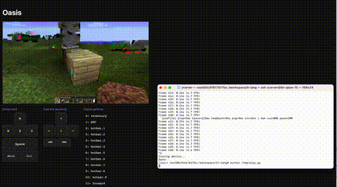
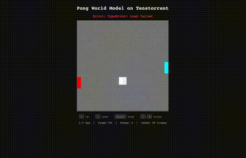

# tt-lang-models

Reference models that are partially or entirely implemented using [TT-Lang](https://github.com/tenstorrent/tt-lang).

---

## [DFlash](dflash/)

DFlash is a lightweight cross-attention draft model for speculative decoding on Tenstorrent hardware. It proposes 16 tokens in parallel, verified by a target Qwen3-30B LLM, achieving a 5-6x decoding speedup. Draft model kernels (RoPE, RMSNorm, SiLU, residual adds) run entirely on device via TT-Lang.

Acceptance rate matches the PyTorch reference model. With caching and 120k context, the draft forward pass runs in 93ms (vs 887ms without caching).

Also includes a full [Qwen3-Coder-30B-A3B inference implementation](dflash/qwen3_inference.py), a 48-layer MoE target model running on 4-chip TP with traced execution and zero host transfers in the hot loop. TT-Lang kernels cover RMSNorm, per-head RMSNorm, RoPE, SiLU, residual adds, softmax, cross-attention, and argmax.

## [Engram](Engram/)

A port of the DeepSeek Engram conditional memory module to TT-Lang on Wormhole. Engram uses streaming dataflow kernels with inter-core boundary sharing via PipeNet for overlap-aware depthwise convolution.

| | Gating | Conv | All Kernels |
|---|---|---|---|
| **TTNN** | 3.86 ms | 0.99 ms | 4.84 ms |
| **TT-Lang** | 1.15 ms | 1.02 ms | 2.17 ms |

## [nanochat](nanochat/)

nanochat inference entirely in TT-Lang.

## [Oasis](open-oasis/)

Real-time Minecraft world generation on Tenstorrent Blackhole using the Oasis 500M diffusion transformer. Runs end-to-end inference (DiT denoising, VAE decode, video output) in a single captured trace at 8 FPS. Supports multi-chip 4-way tensor parallelism.

## [Qwen-Image](qwen-image-tt-xla/)

TTNN + TT-Lang implementation of Qwen-Image 20B image generation across 4 Blackhole chips.

**TT-Lang:**
| Resolution | Steps | Time |
|---|---|---|
| 256x256 | 4 | 1.1s |
| 256x256 | 20 | 5.3s |
| 512x512 | 60 | 37.7s |
| 1024x1024 | 60 | 146.6s |

**XLA:**
| Resolution | CFG | Steps | Per-step | Total |
|---|---|---|---|---|
| 256x256 | 4.0 | 15 | 1.75s | 28s |
| 256x256 | 1.0 | 15 | 1.04s | 18s |
| 512x512 | 4.0 | 20 | 5.42s | 112s |

Normalized per-step, TT-Lang is ~4-7x faster at 256x256 and ~8.6x faster at 512x512.

## [Micelle MD](micelle-demo/)

Cell-list molecular dynamics on Tenstorrent hardware using TT-Lang. Full Ewald electrostatics with LJ short-range forces, periodic boundary conditions, and on-device Verlet integration. Validated at 10K atoms, 10K steps, 1.1ms/step.

## [Toy World Model](toy-wm/)

A Pong world model based on a diffusion transformer, trained on 9 hours of gameplay, running interactively on a single Blackhole card.

